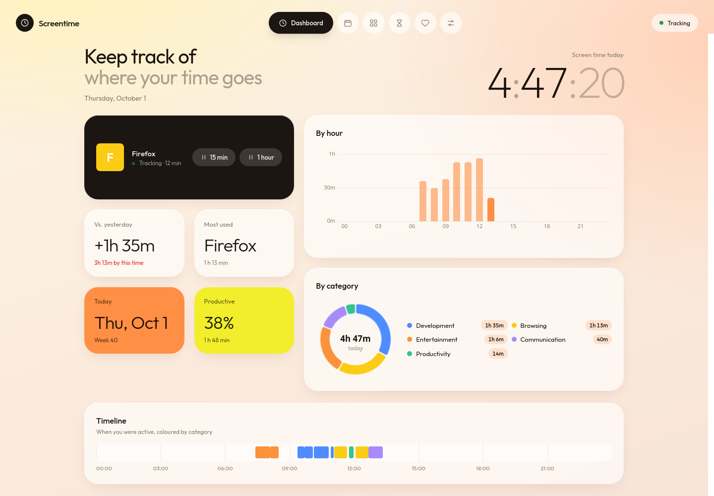

# Screentime

An open-source, local-first screentime and digital wellbeing app for Linux: track app usage, see insights, get nudged to take breaks, and enforce limits — all without your data ever leaving your machine.



<sub>Screenshots use generated demo data from the UI's built-in mock daemon, not real usage. <a href="docs/media/dashboard-dark.png">Dark</a> · <a href="docs/media/trends.png">Trends</a> · <a href="docs/media/limits.png">Limits</a></sub>

> **Status:** feature-complete for v1 on GNOME/Wayland, but not yet released. The tracker, dashboard, limits, break reminders, downtime, focus mode, browser extension and a `.deb` all exist and are unit-tested; several things have not yet been verified on real hardware. See the [roadmap](docs/architecture.md#roadmap) for exactly what has and hasn't.

## What it does

- **Tracks** which app you're using, and for how long, on GNOME/Wayland (the hardest case) and X11. Idle time is never counted, and suspend doesn't inflate sessions.
- **Shows** today and trends: timeline, hourly and category charts, top apps and sites, versus-yesterday.
- **Nudges**: daily limits for an app, category or website; break reminders; a downtime window; focus mode.
- **Per-site time** with an optional browser extension (hostnames only, private windows ignored).
- **Yours**: export to CSV/JSON, delete your history in one click.

## Principles

- **Local-only data.** Everything lives in `~/.local/share/screentime/`. Nothing is uploaded anywhere.
- **No telemetry.** The daemon never makes a network call.
- **Low idle footprint.** The tracker is a lightweight background service, not an Electron app running 24/7 (about 43 MB resident while idle).
- **Pluggable per-desktop adapters.** GNOME Wayland and X11 now; KDE Wayland and wlroots compositors next.

**Non-goals for v1:** cloud sync, mobile apps, multi-user parental controls. Limits are nudges, not locks: v1 never closes an app or blocks a site.

## Architecture

A background tracker daemon owns all data; the desktop UI is only a client and tracking keeps running while the UI is closed. See [`docs/architecture.md`](docs/architecture.md) for the full design, data model, IPC contracts and rules, and [`docs/adr/`](docs/adr) for the decisions behind it.

```
GNOME Shell extension ─┐
Mutter IdleMonitor ─────┼─ D-Bus ──> Tracker daemon (systemd --user) ──> SQLite
Browser extension ──────┘                    │
                                       Unix socket JSON-RPC
                                              │
                                        Electrobun UI
```

## Repo structure

```
apps/desktop/          Electrobun app (Svelte UI + tray)
apps/daemon/           tracker daemon, rules engine, RPC server
adapters/              per-desktop focus/idle adapters (GNOME extension; X11 lives in the daemon)
extensions/browser/    WebExtension + native messaging host
packages/shared/       Zod schemas, RPC types, settings, categories
packages/db/           SQLite migrations (embedded) and client
packaging/             systemd units, .desktop file, .deb build
docs/                  architecture, ADRs, adapter guide
```

## Getting started

Requires [Bun](https://bun.sh) >= 1.1 on Linux. Ubuntu with GNOME on Wayland is the reference setup.

```bash
bun install

# 1. GNOME/Wayland only: install the focus extension, then log out and back in once
adapters/gnome-extension/install.sh

# 2. Run the tracker (in the foreground, or as a systemd user service)
bun run dev:daemon
packaging/systemd/install-dev.sh          # alternative: start at login

# 3. Open the dashboard (first run downloads the Electrobun toolchain)
bun run dev:desktop
```

The dashboard also runs in a plain browser against demo data, with no daemon: `bun run --cwd apps/desktop hmr`, then open <http://localhost:5173>. See [`apps/desktop/README.md`](apps/desktop/README.md).

For per-site time, install the [browser extension](extensions/browser/README.md). Optional on X11: `sudo apt install xprintidle` for idle detection.

To build a package: `packaging/deb/build.sh` (see [`packaging/deb`](packaging/deb/README.md)).

## Development

```bash
bun run lint
bun run typecheck
bun test
```

`SCREENTIME_DEBUG=1 bun run dev:daemon` logs focus, idle and pause events (never window titles unless you enabled them).

## Contributing

Contributions are very welcome — see [CONTRIBUTING.md](CONTRIBUTING.md). Good first contributions include new desktop adapters, app categories, UI translations, and verifying the pieces we haven't been able to test (X11, other GNOME versions, the browser extension in a real browser); look for issues labeled `good first issue`.

## Privacy promise

- No network calls from the daemon, ever.
- All data stays in `~/.local/share/screentime/`.
- Window titles are off by default (opt-in only).
- The browser extension sends only the hostname, never the page path, query or title.
- One-click data wipe from the dashboard settings (Settings → Your data).

## License

[GPL-3.0-or-later](LICENSE).
