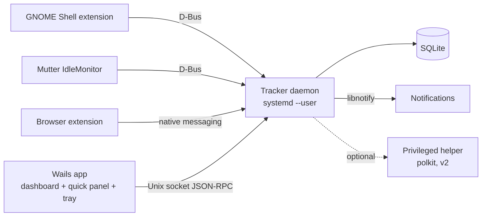

# Linux Screentime & Wellbeing App — Architecture

Sep 25, 2026 · @Akshay

## Overview

An open-source, local-first screentime and digital wellbeing app for Linux: track app usage, show insights, nudge breaks, enforce limits.

- **First target:** Ubuntu, GNOME on Wayland (the maintainer's setup, and the hardest case).
- **Later:** KDE Wayland, wlroots (Hyprland/Sway), X11.
- **Principles:** local-only data, no telemetry, low idle footprint, pluggable per-desktop adapters.
- **Non-goals (v1):** cloud sync, mobile, multi-user parental controls.

## Architecture

A background tracker daemon owns all data. The Wails desktop app is only a client. Tracking keeps running while the UI is closed.



| Component | Responsibility | Runs as |
| --- | --- | --- |
| Focus adapter | Reports focused app (app\_id, title, pid) on change | GNOME Shell extension (per desktop) |
| Tracker daemon | Heartbeats, idle merge, sessions, rules engine, limits, reminders | `systemd --user` service |
| SQLite store | Events, sessions, limits, categories | File in `~/.local/share/<app>/` |
| Wails app (`cmd/screentime`) | Dashboard, quick panel, settings, tray, onboarding | User app, launched on demand; windows exist only while open |
| Browser extension | Active tab domain and time; site blocking | Firefox/Chromium extension |
| Privileged helper (v2) | Tamper-resistant limits, hosts/DNS blocking | System service via polkit |

## Tech stack

The daemon and native host are Go; the dashboard, browser extension and shared schemas are TypeScript. Go was chosen to meet the footprint budget, to speak D-Bus without a subprocess, and to cross-compile ([ADR 7](adr/0007-migrate-to-go.md), [migration notes](migration-to-go.md)).

| Layer | Choice | Why |
| --- | --- | --- |
| Desktop shell | Wails v3 (WebKitGTK 4.1 via `-tags gtk3`, Go): a tray process, and one short-lived process per window | Tray and multiple windows built in; one 10 MB binary; a closed window gives all its memory back; see [ADR 9](adr/0009-wails-v3-ui-shell.md), [ADR 10](adr/0010-windows-run-as-their-own-processes.md) |
| UI | Svelte 5 + Tailwind 4 | Light runtime, runs well on WebKitGTK |
| Charts | uPlot (bars), hand-written SVG (donut) | uPlot is ~45 KB; ECharts for one donut added ~400 KB, so it was dropped |
| Daemon | Go (`cmd/screentimed`) | One small static binary (~8 MB, ~10 MB idle); build tags for per-OS providers |
| D-Bus | `github.com/godbus/dbus/v5` on one persistent connection | Real idle watches and unicast signals; replaced the `gdbus` subprocess of [ADR 6](adr/0006-dbus-through-gdbus.md) |
| Storage | SQLite via `modernc.org/sqlite` (pure Go, no cgo), WAL mode | Zero-dependency, fast, easy to back up |
| IPC | JSON-RPC 2.0 over a Unix socket | Simple, language-neutral, easy to debug with `socat` |
| Schemas | Zod (shared package) exported to `contract/` JSON Schema; Go structs by hand | Fixtures check every field on both sides |
| GNOME adapter | GNOME Shell extension (GJS, ESM, GNOME 45+) | The only reliable focus source on GNOME Wayland |
| Notifications | `org.freedesktop.Notifications` over D-Bus | Native on every desktop |
| Monorepo | One Go module; Bun workspaces for the TypeScript parts | No extra tooling |
| Quality | `gofmt`/`go vet`/`go test -race`/`govulncheck`; Biome and `bun test` for TS; GitHub Actions | Fast, minimal config |
| Packaging | .deb + AppImage; extension via extensions.gnome.org | Flatpak's sandbox blocks tracking |

## Focus adapters

Each desktop gets an adapter that implements the same interface. The daemon picks one at startup from `$XDG_SESSION_TYPE` and `$XDG_CURRENT_DESKTOP`.

```ts
interface FocusProvider {
  id: string;                       // "gnome-wayland"
  isAvailable(): Promise<boolean>;
  onFocusChange(cb: (w: FocusedWindow) => void): Unsubscribe;
  onIdleChange(cb: (idle: boolean) => void, thresholdMs: number): Unsubscribe;
}
type FocusedWindow = { appId: string; title?: string; pid?: number; ts: number };
```

| Adapter | Focus source | Idle source | Priority |
| --- | --- | --- | --- |
| gnome-wayland | Own Shell extension that emits `FocusChanged` on the session bus | `org.gnome.Mutter.IdleMonitor` | v1 |
| x11 | `_NET_ACTIVE_WINDOW` over the X protocol (xgb) | MIT-SCREEN-SAVER extension | v1.x |
| kde-wayland | KWin script that calls the daemon over D-Bus ([ADR 11](adr/0011-kde-wayland-adapter.md)) | `ext-idle-notify-v1` | v2, implemented |
| hyprland / sway | IPC socket events | `ext-idle-notify-v1` | v2 |

- **App identity:** `appId` = the `.desktop` file ID (e.g. `org.mozilla.firefox`), with WM\_CLASS as the fallback. Icons and names come from the `.desktop` files.
- **Window titles:** opt-in only, because they often contain private data.

## Data model

The daemon turns focus and idle events into sessions. If the same app is still focused and the user isn't idle, it extends the open row instead of inserting a new one.

```sql
CREATE TABLE apps (
  id INTEGER PRIMARY KEY, app_id TEXT UNIQUE NOT NULL,
  name TEXT, icon TEXT, category_id INTEGER REFERENCES categories(id)
);
CREATE TABLE categories (id INTEGER PRIMARY KEY, name TEXT UNIQUE, color TEXT, productive INTEGER);
CREATE TABLE sessions (
  id INTEGER PRIMARY KEY, app_id INTEGER NOT NULL REFERENCES apps(id),
  title TEXT, start_ts INTEGER NOT NULL, end_ts INTEGER NOT NULL,
  source TEXT NOT NULL            -- 'desktop' | 'browser'
);
CREATE TABLE web_sessions (id INTEGER PRIMARY KEY, domain TEXT NOT NULL, start_ts INTEGER, end_ts INTEGER);
CREATE TABLE limits (
  id INTEGER PRIMARY KEY, target_type TEXT, target TEXT,   -- 'app' | 'category' | 'domain'
  daily_ms INTEGER, schedule TEXT, action TEXT             -- 'notify' | 'overlay' | 'block'
);
CREATE TABLE settings (key TEXT PRIMARY KEY, value TEXT NOT NULL);   -- one JSON value per key
CREATE UNIQUE INDEX idx_limits_target ON limits(target_type, target); -- one limit per target
CREATE INDEX idx_sessions_start ON sessions(start_ts);
CREATE INDEX idx_web_sessions_start ON web_sessions(start_ts);
```

Categories are seeded (Development, Productivity, Communication, Social, Entertainment, Browsing, Utilities, Other) and apps are categorised by ID on first sight (`packages/shared/src/categories.ts`); a category chosen by the user is never overwritten. `categories.productive` is 1 productive, 0 distracting, NULL neutral.

- **Heartbeat:** every 5 s while focused. The open session's `end_ts` is updated in place, so a crash loses 5 s at most. When the user switches apps the old session ends at the switch, not at the last heartbeat.
- **Suspend:** a heartbeat gap well over 10 s means the machine slept; the session is split there instead of being stretched across the gap.
- **Merge rule:** same app, gap under 10 s, and not idle → extend the session. Otherwise close it and open a new one.
- **Idle:** 3 min with no input closes the session (configurable). The session ends where idleness *began* (threshold ago), so idle time is never counted, and tracking resumes from the last focused window when activity returns. Media playing counts as active later on, via the MPRIS D-Bus interface.
- **Timestamps:** Unix ms in UTC; convert to local time only in the UI.
- **Migrations:** numbered SQL files, tracked with `PRAGMA user_version`.

## IPC contracts

The UI talks to the daemon with JSON-RPC 2.0 over `$XDG_RUNTIME_DIR/<app>/daemon.sock` (mode 0600). All payloads are Zod schemas in `packages/shared`.

| Method / event | Direction | Payload → result |
| --- | --- | --- |
| `usage.summary` | UI → daemon | `{from, to, groupBy: 'app' \| 'category' \| 'hour' \| 'day'}` → rows of `{key, ms}` (sessions are clipped to the window and split across hour/day boundaries) |
| `usage.timeline` | UI → daemon | `{date}` → list of sessions |
| `usage.web` | UI → daemon | `{from, to}` → rows of `{key: domain, ms}` |
| `apps.list` / `apps.setCategory` | UI → daemon | app info (name, icon, category) / `{appId, categoryId}` |
| `categories.list` | UI → daemon | categories |
| `limits.list` / `.set` / `.delete` | UI → daemon | limit objects (`set` upserts by id or target) |
| `settings.get` / `.set` | UI → daemon | typed settings (`packages/shared/src/settings.ts`); `set` takes a validated partial |
| `tracker.pause` / `.resume` / `.status` | UI → daemon | `{minutes}` → `{resumeAt}` / `{ok}` / current state |
| `focus.start` / `.stop` | UI → daemon | `{minutes}` → `{until}` / `{ok}` |
| `data.export` / `data.wipe` | UI → daemon | `{format, from?, to?}` → `{filename, content}` / `{everything}` → `{ok}` |
| `event.status` | daemon → UI (notification) | full tracker status, on any state change |
| `event.focus` | daemon → UI (notification) | `{appId, since}`, for a live "now" view |
| `event.limitHit` | daemon → UI (notification) | `{limitId, action}` |
| `event.reminder` | daemon → UI (notification) | `{kind: 'break' \| 'downtime' \| 'focus', message}` |

- **GNOME extension → daemon:** D-Bus signal `io.github.<app>.Focus.FocusChanged(s appId, s title, u pid)`.
- **Browser → daemon:** native messaging host (`screentimed native-host`) that forwards `{domain, active}` to the socket after checking the socket belongs to the user.
- **Versioning:** a `version` handshake on connect. The daemon rejects clients on a different major version.
- **Single instance:** the daemon refuses to start if another is already listening on the socket (a second one would unlink it and both would write the same database).
- **UI bridge:** the webview never opens the socket. The Go shell owns the connection, in the tray and in each window process (`internal/shell`, with automatic reconnect and S3 ownership checks), forwards only the UI's allow-listed method names, and relays notifications. See [ADR 3](adr/0003-ui-reaches-the-daemon-through-its-main-process.md).

## Wellbeing rules

`internal/rules`. Everything is derived from the database and the clock on each 5 s tick, never from long timers, so a suspend/resume can't make a rule miss or double-fire ([ADR 4](adr/0004-rules-are-derived-from-the-database-on-each-tick.md)).

- **Daily limits** (app, category or domain): fire once per day when usage passes `daily_ms`, with a notification and `event.limitHit`. `overlay`/`block` actions re-appear every 5 min while the user keeps using the target. v1 limits are nudges; nothing is closed or blocked. An optional `schedule` (`HH:MM-HH:MM`, may wrap midnight) restricts *enforcement* to a window; usage still counts for the whole day.
- **Break reminders:** after `breakEveryMinutes` of continuous activity, at most every 10 min. Being away (idle, paused or suspended) for `breakLengthMinutes` counts as a break.
- **Downtime:** during the configured window, a nudge every 15 min while the computer is in use.
- **Focus mode:** for N minutes, a nudge when an app in a category marked distracting (`productive = 0`) takes focus (rate limited), and a notice when the session ends.

Notifications go to `org.freedesktop.Notifications`; a missing notification daemon is logged and never affects tracking.

## Repo structure

One monorepo using Bun workspaces. Each package can be built and tested on its own.

```
/
├─ cmd/screentimed/       # tracker daemon (Go) and `native-host` subcommand
├─ internal/              # store, tracker, rules, rpc, focus providers, nativehost
├─ cmd/screentime/        # desktop app (Go + Wails)
├─ frontend/              # the Svelte UI it shows
├─ adapters/
│  ├─ gnome-extension/    # GJS Shell extension (focus → D-Bus)
│  ├─ x11/
│  └─ kwin-script/
├─ extensions/
│  └─ browser/            # WebExtension + native messaging host
├─ packages/
│  └─ shared/             # Zod schemas, RPC types, constants
├─ contract/              # frozen IPC contract: JSON Schema + golden fixtures
├─ packaging/             # systemd unit, .desktop, deb/AppImage scripts
├─ docs/                  # architecture, ADRs, adapter guide
└─ .github/               # CI, issue/PR templates
```

## Roadmap

> The daemon and native host are Go ([ADR 7](adr/0007-migrate-to-go.md), [migration notes](migration-to-go.md)); the UI shell is Wails v3 ([ADR 9](adr/0009-wails-v3-ui-shell.md)), with each window in its own process ([ADR 10](adr/0010-windows-run-as-their-own-processes.md)).

A phase starts only after the previous phase meets its exit criteria. **Status** is what has actually been verified, not just written.

| Phase | Scope | Exit criteria | Status |
| --- | --- | --- | --- |
| 0. Spike | Desktop shell hello world on Ubuntu; GNOME extension logs focus; D-Bus from the daemon | Focus changes print in the daemon terminal | **Done.** The first shell (Electrobun, since replaced by Wails) ran on Ubuntu 26.04/GNOME 50; D-Bus first used `dbus-next`, later replaced by `gdbus` (ADR 6) |
| 1. Tracker | Daemon, GNOME adapter, idle, SQLite, systemd unit | 24 h of accurate sessions, daemon under 60 MB RSS | **Built and unit-tested (Go).** Idle RSS ~10 MB in a sandbox with no desktop (it was 43 MB under Bun); the 24 h soak on a real session has not been run |
| 2. Dashboard | Dashboard: today, week, per-app view, tray, pause | Totals match a manual check to within 1 min per hour | **Built.** Runs against the live daemon; the manual accuracy check has not been done |
| 3. Wellbeing | Break reminders, daily limits (notify + overlay), downtime schedule, focus mode | Limits fire reliably across suspend/resume | **Built.** Suspend/resume covered with a fake clock; not yet exercised on a real suspend |
| 4. Web + desktops | Browser extension, X11 adapter, categories | Per-site time works in Firefox and Chromium | **Built, not browser-tested.** Native host verified end to end; the extension itself has not been loaded in a real browser. X11 provider integration-tested against Xvfb in CI, not yet on a real X11 session |
| 5. v1.0 | .deb + AppImage, extension published on EGO, docs | Fresh install to tracking in under 5 min | **Partial.** `.deb` builds and its parts run; not installed system-wide. No AppImage; not on extensions.gnome.org |
| 6. Later | KDE and wlroots adapters, privileged helper, CSV/JSON export | Driven by the community | Export done; the rest is open |

## Open-source setup

- **License:** GPL-3.0-or-later. extensions.gnome.org requires GPL-compatible code, and copyleft keeps forks open. Choose MIT only if you want to allow proprietary reuse.
- **Repo files:** README with a GIF, CONTRIBUTING, CODE\_OF\_CONDUCT, SECURITY, issue and PR templates, `good first issue` labels.
- **Docs:** `docs/architecture.md` (this doc), `docs/adapters.md` (how to add a desktop), ADRs in `docs/adr/`.
- **CI:** lint, typecheck, `bun test`, and a build of every package on each PR. Tagged releases publish the .deb and AppImage.
- **Conventions:** Conventional Commits, semver, changesets for the changelog.
- **Privacy promise:** no network calls from the daemon, data stays in `~/.local/share`, titles off by default, one-click data wipe (Settings → Your data). The browser extension sends only the hostname, never the path, query or title, and ignores private windows. This is in the README.
- **Good first contributions:** new desktop adapters, app categories, UI translations.

## Risks and open questions

| Risk | Impact | Mitigation |
| --- | --- | --- |
| Wails v3 is a beta; Linux tray and WebKitGTK may have quirks | UI bugs, blocked features | Pinned version; keep the UI a thin client of the daemon and the shell a thin layer over `internal/shell`, so v2 or Tauri could replace it |
| GNOME Shell API changes each release | Extension breaks on upgrade | Keep the extension tiny (focus only); test on the current and previous GNOME |
| Daemon can't reach the session bus | No focus or notifications | The `gdbus` tool is part of GLib and present on GNOME systems; the provider reports it as unavailable if missing |
| Daemon memory while idle | Heavy for an always-on service | Was 43 MB under Bun; the Go daemon idled at ~10 MB in a sandbox with no desktop. Record the real-session number after the 24 h soak (`scripts/soak`) |
| Users can bypass soft limits | Weak enforcement | Treat v1 as nudges; tamper resistance goes in the v2 privileged helper |

- [x] Project name and app ID: `screentime` / `io.github.akkki007.screentime` (already used throughout)
- [ ] Does watching fullscreen video count as screentime or as idle? (MPRIS rule)
- [x] Which Ubuntu/GNOME versions to support at minimum? The extension declares GNOME 45–50 and has only been run on 50.1; test 45–49 before relying on it
