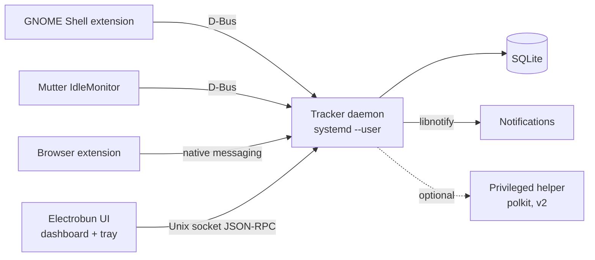

# Linux Screentime & Wellbeing App — Architecture

Sep 25, 2026 · @Akshay

## Overview

An open-source, local-first screentime and digital wellbeing app for Linux: track app usage, show insights, nudge breaks, enforce limits.

- **First target:** Ubuntu, GNOME on Wayland (the maintainer's setup, and the hardest case).
- **Later:** KDE Wayland, wlroots (Hyprland/Sway), X11.
- **Principles:** local-only data, no telemetry, low idle footprint, pluggable per-desktop adapters.
- **Non-goals (v1):** cloud sync, mobile, multi-user parental controls.

## Architecture

A background tracker daemon owns all data. The Electrobun UI is only a client. Tracking keeps running while the UI is closed.



| Component | Responsibility | Runs as |
| --- | --- | --- |
| Focus adapter | Reports focused app (app\_id, title, pid) on change | GNOME Shell extension (per desktop) |
| Tracker daemon | Heartbeats, idle merge, sessions, rules engine, limits, reminders | `systemd --user` service |
| SQLite store | Events, sessions, limits, categories | File in `~/.local/share/<app>/` |
| Electrobun UI | Dashboard, settings, tray, onboarding | User app, launched on demand |
| Browser extension | Active tab domain and time; site blocking | Firefox/Chromium extension |
| Privileged helper (v2) | Tamper-resistant limits, hosts/DNS blocking | System service via polkit |

## Tech stack

The whole stack is TypeScript/JavaScript, so contributors need only one language. Rust stays an option for the daemon if its footprint becomes a problem.

| Layer | Choice | Why |
| --- | --- | --- |
| Desktop shell | Electrobun (Bun + WebKitGTK) | Small bundles, TS end to end, `bun:sqlite` and `bun:ffi` built in |
| UI | Svelte 5 + Tailwind | Light runtime, runs well on WebKitGTK |
| Charts | uPlot (time series), ECharts (breakdowns) | Fast with thousands of points |
| Daemon | Bun + TypeScript | Shares types with the UI; one toolchain |
| D-Bus | `dbus-next` | Pure JS; confirm it works under Bun in the spike |
| Storage | SQLite via `bun:sqlite`, WAL mode | Zero-dependency, fast, easy to back up |
| IPC | JSON-RPC 2.0 over a Unix socket | Simple, language-neutral, easy to debug with `socat` |
| Schemas | Zod (shared package) | One source of truth for IPC and config |
| GNOME adapter | GNOME Shell extension (GJS, ESM, GNOME 45+) | The only reliable focus source on GNOME Wayland |
| Notifications | `org.freedesktop.Notifications` over D-Bus | Native on every desktop |
| Monorepo | Bun workspaces | No extra tooling |
| Quality | Biome (lint + format), `bun test`, GitHub Actions | Fast, minimal config |
| Packaging | .deb + AppImage; extension via extensions.gnome.org | Flatpak's sandbox blocks tracking |

## Focus adapters

Each desktop gets an adapter that implements the same interface. The daemon picks one at startup from `$XDG_SESSION_TYPE` and `$XDG_CURRENT_DESKTOP`.

```ts
interface FocusProvider {
  id: string;                       // "gnome-wayland"
  isAvailable(): Promise<boolean>;
  onFocusChange(cb: (w: FocusedWindow) => void): Unsubscribe;
  onIdleChange(cb: (idle: boolean) => void, thresholdMs: number): Unsubscribe;
}
type FocusedWindow = { appId: string; title?: string; pid?: number; ts: number };
```

| Adapter | Focus source | Idle source | Priority |
| --- | --- | --- | --- |
| gnome-wayland | Own Shell extension that emits `FocusChanged` on the session bus | `org.gnome.Mutter.IdleMonitor` | v1 |
| x11 | `_NET_ACTIVE_WINDOW` via xcb or `bun:ffi` | XScreenSaver extension | v1.x |
| kde-wayland | KWin script that calls the daemon over D-Bus | `org.freedesktop.ScreenSaver` | v2 |
| hyprland / sway | IPC socket events | `ext-idle-notify-v1` | v2 |

- **App identity:** `appId` = the `.desktop` file ID (e.g. `org.mozilla.firefox`), with WM\_CLASS as the fallback. Icons and names come from the `.desktop` files.
- **Window titles:** opt-in only, because they often contain private data.

## Data model

The daemon turns focus and idle events into sessions. If the same app is still focused and the user isn't idle, it extends the open row instead of inserting a new one.

```sql
CREATE TABLE apps (
  id INTEGER PRIMARY KEY, app_id TEXT UNIQUE NOT NULL,
  name TEXT, icon TEXT, category_id INTEGER REFERENCES categories(id)
);
CREATE TABLE categories (id INTEGER PRIMARY KEY, name TEXT UNIQUE, color TEXT, productive INTEGER);
CREATE TABLE sessions (
  id INTEGER PRIMARY KEY, app_id INTEGER NOT NULL REFERENCES apps(id),
  title TEXT, start_ts INTEGER NOT NULL, end_ts INTEGER NOT NULL,
  source TEXT NOT NULL            -- 'desktop' | 'browser'
);
CREATE TABLE web_sessions (id INTEGER PRIMARY KEY, domain TEXT NOT NULL, start_ts INTEGER, end_ts INTEGER);
CREATE TABLE limits (
  id INTEGER PRIMARY KEY, target_type TEXT, target TEXT,   -- 'app' | 'category' | 'domain'
  daily_ms INTEGER, schedule TEXT, action TEXT             -- 'notify' | 'overlay' | 'block'
);
CREATE INDEX idx_sessions_start ON sessions(start_ts);
```

- **Heartbeat:** every 5 s while focused. The open session's `end_ts` is updated in place, so a crash loses 5 s at most.
- **Merge rule:** same app, gap under 10 s, and not idle → extend the session. Otherwise close it and open a new one.
- **Idle:** 3 min with no input closes the session (configurable). Media playing counts as active later on, via the MPRIS D-Bus interface.
- **Timestamps:** Unix ms in UTC; convert to local time only in the UI.
- **Migrations:** numbered SQL files, tracked with `PRAGMA user_version`.

## IPC contracts

The UI talks to the daemon with JSON-RPC 2.0 over `$XDG_RUNTIME_DIR/<app>/daemon.sock` (mode 0600). All payloads are Zod schemas in `packages/shared`.

| Method / event | Direction | Payload → result |
| --- | --- | --- |
| `usage.summary` | UI → daemon | `{from, to, groupBy: 'app' \| 'category' \| 'hour'}` → rows of `{key, ms}` |
| `usage.timeline` | UI → daemon | `{date}` → list of sessions |
| `limits.list` / `.set` / `.delete` | UI → daemon | limit objects |
| `settings.get` / `.set` | UI → daemon | config object |
| `tracker.pause` | UI → daemon | `{minutes}` → `{resumeAt}` |
| `event.focus` | daemon → UI (notification) | `{appId, since}`, for a live "now" view |
| `event.limitHit` | daemon → UI (notification) | `{limitId, action}` |

- **GNOME extension → daemon:** D-Bus signal `io.github.<app>.Focus.FocusChanged(s appId, s title, u pid)`.
- **Browser → daemon:** native messaging host (a small Bun script) that forwards `{domain, active}` to the socket.
- **Versioning:** a `version` handshake on connect. The daemon rejects clients on a different major version.

## Repo structure

One monorepo using Bun workspaces. Each package can be built and tested on its own.

```
/
├─ apps/
│  ├─ desktop/            # Electrobun app (Svelte UI + tray)
│  └─ daemon/             # tracker daemon, rules engine, RPC server
├─ adapters/
│  ├─ gnome-extension/    # GJS Shell extension (focus → D-Bus)
│  ├─ x11/
│  └─ kwin-script/
├─ extensions/
│  └─ browser/            # WebExtension + native messaging host
├─ packages/
│  ├─ shared/             # Zod schemas, RPC types, constants
│  └─ db/                 # migrations, queries
├─ packaging/             # systemd unit, .desktop, deb/AppImage scripts
├─ docs/                  # architecture, ADRs, adapter guide
└─ .github/               # CI, issue/PR templates
```

## Roadmap

A phase starts only after the previous phase meets its exit criteria.

| Phase | Scope | Exit criteria |
| --- | --- | --- |
| 0. Spike | Electrobun hello world on Ubuntu; GNOME extension logs focus; `dbus-next` under Bun | Focus changes print in the daemon terminal |
| 1. Tracker | Daemon, GNOME adapter, idle, SQLite, systemd unit | 24 h of accurate sessions, daemon under 60 MB RSS |
| 2. Dashboard | Electrobun UI: today, week, per-app view, tray, pause | Totals match a manual check to within 1 min per hour |
| 3. Wellbeing | Break reminders, daily limits (notify + overlay), downtime schedule, focus mode | Limits fire reliably across suspend/resume |
| 4. Web + desktops | Browser extension, X11 adapter, categories | Per-site time works in Firefox and Chromium |
| 5. v1.0 | .deb + AppImage, extension published on EGO, docs | Fresh install to tracking in under 5 min |
| 6. Later | KDE and wlroots adapters, privileged helper, CSV/JSON export | Driven by the community |

## Open-source setup

- **License:** GPL-3.0-or-later. extensions.gnome.org requires GPL-compatible code, and copyleft keeps forks open. Choose MIT only if you want to allow proprietary reuse.
- **Repo files:** README with a GIF, CONTRIBUTING, CODE\_OF\_CONDUCT, SECURITY, issue and PR templates, `good first issue` labels.
- **Docs:** `docs/architecture.md` (this doc), `docs/adapters.md` (how to add a desktop), ADRs in `docs/adr/`.
- **CI:** lint, typecheck, `bun test`, and a build of every package on each PR. Tagged releases publish the .deb and AppImage.
- **Conventions:** Conventional Commits, semver, changesets for the changelog.
- **Privacy promise:** no network calls from the daemon, data stays in `~/.local/share`, titles off by default, one-click data wipe. Put this in the README.
- **Good first contributions:** new desktop adapters, app categories, UI translations.

## Risks and open questions

| Risk | Impact | Mitigation |
| --- | --- | --- |
| Electrobun is young; Linux tray and WebKitGTK may have quirks | UI bugs, blocked features | Keep the UI a thin client of the daemon; Tauri is the fallback shell |
| GNOME Shell API changes each release | Extension breaks on upgrade | Keep the extension tiny (focus only); test on the current and previous GNOME |
| `dbus-next` gaps under Bun | Daemon can't reach the session bus | Checked in the Phase 0 spike; fallback is shelling out to `gdbus` |
| Bun memory while idle | Heavy for an always-on service | Measure in Phase 1; port the daemon to Rust if RSS stays over 60 MB |
| Users can bypass soft limits | Weak enforcement | Treat v1 as nudges; tamper resistance goes in the v2 privileged helper |

- [ ] Project name and app ID (e.g. `io.github.akkki007.<name>`)
- [ ] Does watching fullscreen video count as screentime or as idle? (MPRIS rule)
- [ ] Which Ubuntu/GNOME versions to support at minimum?
